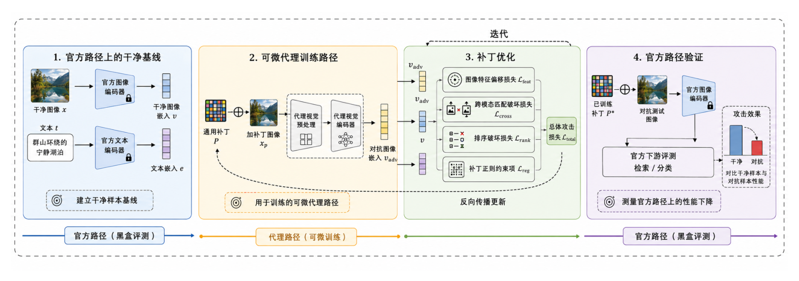

# AdvQwen

中文说明 | [English](README_EN.md)

`AdvQwen` 是我的毕业论文“基于多模态嵌入模型的对抗攻击迁移研究”对应的公开代码仓库，研究对象是
`Qwen3-VL-Embedding-2B` 上的可迁移对抗补丁攻击。项目重点关注：

- 如何在图文检索任务上训练通用对抗补丁
- 如何在官方推理路径下评测攻击效果
- 如何验证补丁从检索任务向零样本分类任务的迁移性

本仓库当前整理为适合公开展示与复现主流程的精简版本，仅保留核心代码与说明文档，不包含数据集、模型权重、实验缓存和日志。

## 论文摘要

随着视觉语言预训练模型和多模态大模型的发展，多模态嵌入模型逐渐成为图文检索和图像分类等任务的重要基础模型。该类模型通常将图像和文本映射到统一向量空间，并通过嵌入相似度完成跨模态匹配。然而，已有研究表明，深度神经网络容易受到对抗样本影响，攻击者可以通过构造微小扰动或局部补丁改变模型输出。现有对抗攻击研究主要集中于传统图像分类模型或 CLIP 类视觉语言模型，对于 `Qwen3-VL-Embedding` 等新型多模态嵌入模型，其对抗鲁棒性和攻击迁移性仍缺乏充分研究。

针对上述问题，本文提出一种面向多模态嵌入模型的对抗补丁迁移攻击方法，并命名为 `AdvQwen`。该方法以通用图像对抗补丁为攻击形式，在不修改文本输入和模型参数的条件下，破坏图像嵌入与文本嵌入之间的语义匹配关系。为适配 `Qwen3-VL-Embedding` 的官方推理流程与补丁训练需求，本文构建了“可微代理路径训练、官方路径评测”的双路径攻击框架，并设计了结合图像特征偏移、跨模态匹配破坏和排序破坏的优化目标，使对抗补丁能够直接影响多模态嵌入空间中的相似度排序关系。

在实验评估中，本文选取 `Qwen3-VL-Embedding-2B` 作为受害模型，在 Flickr30K、MS COCO、CIFAR-10 和 ImageNet 等数据集上验证 `AdvQwen` 的攻击效果。实验结果表明，`AdvQwen` 能够降低模型在图文检索任务中的检索性能，并在不同代理数据集和下游数据集之间表现出一定迁移能力。与多种通用攻击方法相比，`AdvQwen` 在图文检索任务上取得了更高的攻击成功率。消融实验进一步表明，排序破坏损失对提升检索攻击效果具有重要作用。本文结果初步表明，新型多模态嵌入模型在通用对抗补丁攻击下仍存在潜在脆弱性，可为多模态嵌入模型的安全评估与鲁棒性研究提供参考。

**关键词：** 多模态嵌入、对抗攻击、迁移攻击、通用对抗补丁

## 项目概览

当前主实验流程如下：

1. 在 Flickr30K 和 MS COCO Karpathy 上运行干净图文检索基线。
2. 使用标准图文对训练通用对抗补丁。
3. 在官方 Qwen 图像编码路径上评测图文检索攻击效果。
4. 将检索任务训练得到的补丁迁移到 CIFAR-10 与 ImageNet 的零样本分类任务。

## 方法框架

下图展示了 AdvQwen 的整体方法框架：



核心思路可以概括为：

- 以 `Qwen3-VL-Embedding-2B` 作为受害模型
- 在训练阶段使用可微代理图像路径，使补丁优化过程可反向传播
- 在评测阶段切回官方图像处理与编码路径，保证结果更贴近真实推理流程
- 同时关注图像特征偏移、跨模态匹配破坏和排序退化带来的攻击效果

更完整的实验命令与配置说明见 `README_EXPERIMENTS.md`。

## 仓库内容

本仓库主要包含：

- 主实验脚本
- 核心模块实现
- 数据集组织方式说明
- 中英文项目说明文档

本仓库默认不包含：

- 原始或标准化后的完整数据集
- 训练得到的补丁权重与模型文件
- 实验输出、缓存、日志
- 答辩材料、论文写作草稿和历史迁移代码

## 数据集说明

项目涉及两类数据集：

### 1. 图文检索数据集

- `Flickr30K`：用于干净基线、补丁训练和攻击评测
- `MS COCO Karpathy`：用于干净基线、补丁训练和攻击评测

这两类数据集在本项目中被整理为统一的 `jsonl` 格式，常见文件包括：

- `train_surrogate.jsonl`
- `train_downstream.jsonl`
- `train_full.jsonl`
- `val_images.jsonl`
- `val_texts.jsonl`
- `test_images.jsonl`
- `test_texts.jsonl`

评测时通过 `labels` 是否有交集来判断图文是否匹配。

### 2. 图像分类数据集

- `CIFAR-10`：用于零样本分类迁移评测
- `ImageNet`：用于更大规模类别空间下的迁移评测

这两类数据集不参与补丁训练，只用于验证图文检索任务上训练出的补丁是否具有跨任务迁移性。

更详细的数据集组织方式、字段说明和任务划分见 `DATASETS.md`。

## 数据集获取

本项目公开仓库不直接提供数据集文件。按照当前实验流程，建议按下面的来源准备数据：

### 1. Flickr30K

本项目当时使用的是 Hugging Face 上的 `nlphuji/flickr30k` 导出版本，并在本地进一步整理为标准检索格式：

- 数据集页面：<https://huggingface.co/datasets/nlphuji/flickr30k>
- 文件列表页：<https://huggingface.co/datasets/nlphuji/flickr30k/tree/main>

### 2. MS COCO Karpathy

本项目使用的是：

- MS COCO 2014 官方图像数据：<https://cocodataset.org/#download>
- Karpathy split 标注文件 `dataset_coco.json`：<https://github.com/Delphboy/karpathy-splits>

在本地实验中，COCO 部分是由 COCO 2014 图像和 `dataset_coco.json` 共同整理得到的标准检索文件。

### 3. CIFAR-10

分类迁移评测中的 CIFAR-10 通过 `torchvision.datasets.CIFAR10` 读取。对应参考入口：

- Torchvision 文档：<https://docs.pytorch.org/vision/master/generated/torchvision.datasets.CIFAR10.html>

当前代码默认 `download=False`，因此需要你先把数据准备到 `data_std/cifar10` 对应位置，或自行修改为自动下载。

### 4. ImageNet

分类迁移评测中的 ImageNet 使用的是验证集目录结构。官方入口：

- ImageNet 官方下载页：<https://www.image-net.org/download>

ImageNet 通常需要注册并按官方方式申请下载。当前代码默认从 `data_std/imagenet` 读取本地验证集数据。

## 环境配置

本项目默认复用官方 [`Qwen3-VL-Embedding`](https://github.com/QwenLM/Qwen3-VL-Embedding/) 仓库的运行环境，而不是单独维护一套完全独立的依赖。

推荐流程如下：

### 1. 先准备官方 Qwen 环境

```bash
git clone https://github.com/QwenLM/Qwen3-VL-Embedding.git
cd Qwen3-VL-Embedding
bash scripts/setup_environment.sh
source .venv/bin/activate
```

### 2. 设置外部依赖路径

```bash
export QWEN_REPO_ROOT=/path/to/Qwen3-VL-Embedding
export QWEN_MODEL_PATH=/path/to/Qwen3-VL-Embedding/models/Qwen3-VL-Embedding-2B
```

如果没有设置 `QWEN_MODEL_PATH`，代码会默认尝试使用：

```text
<本仓库上级目录>/Qwen3-VL-Embedding/models/Qwen3-VL-Embedding-2B
```

## 快速开始

### 1. 干净图文检索基线

```bash
python clean_retrieval_baseline.py \
  --dataset coco_karpathy \
  --image_limit 20 \
  --text_limit 100 \
  --reuse_cache
```

### 2. 图文检索对抗补丁训练与评测

```bash
PYTORCH_CUDA_ALLOC_CONF=expandable_segments:True \
python retrieval_attack.py \
  --train_dataset coco_karpathy \
  --eval_dataset coco_karpathy \
  --num_epochs 1 \
  --eval_every 1 \
  --batch_size 4 \
  --train_limit 64 \
  --test_image_limit 100 \
  --test_text_limit 500 \
  --reuse_clean_cache \
  --save \
  --run_name coco_to_coco_smoke
```

### 3. 分类迁移评测

```bash
python classification_transfer_eval.py \
  --dataset cifar10 \
  --data_root data_std/cifar10 \
  --patch_path /path/to/patch.pt \
  --reuse_clean_cache \
  --save
```

## 主要脚本说明

- `clean_retrieval_baseline.py`：干净样本图文检索基线
- `retrieval_attack.py`：通用对抗补丁训练与检索攻击评测入口
- `retrieval_patch_eval.py`：补丁攻击效果评测辅助脚本
- `classification_transfer_eval.py`：分类迁移评测主入口

## 核心模块说明

- `utils/qwen.py`：Qwen victim model 封装与模型路径解析
- `victims/qwen_trainable.py`：官方评测路径与可微代理图像编码路径
- `utils/patch_utils.py`：补丁初始化、裁剪与贴补丁操作
- `utils/metrics.py`：Recall、排名、mAP、ASR 等指标实现

## 仓库结构

```text
.
├── README.md
├── README_EN.md
├── README_EXPERIMENTS.md
├── DATASETS.md
├── clean_retrieval_baseline.py
├── retrieval_attack.py
├── retrieval_patch_eval.py
├── classification_transfer_eval.py
├── utils/
├── victims/
└── assets/readme/
```

## 结果输出

如果启用保存，实验结果通常会输出到以下目录：

- `output/clean_baseline/`
- `output/features_std/`
- `output/zero_shot_attack/`
- `output/classification_eval/`
- `output/classification_features/`

这些目录默认已被 `.gitignore` 排除，不会进入公开仓库。

## 说明

- 本仓库当前是公开发布版，不包含 `docs/`、`legacy/`、`builders/` 等内部或历史内容。
- 如果你想复现实验，需要自行准备数据集、模型文件和官方 Qwen 环境。
- 更完整的命令示例见 `README_EXPERIMENTS.md`。
